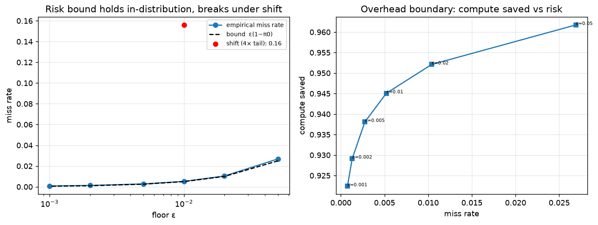

# MTP-MetaEval — explanatory-efficiency scorecard

> **arXiv-ready manuscript:** [paper/main.tex](paper/main.tex) (+ figs, refs.bib);
> submission steps in [paper/ARXIV_SUBMISSION.md](paper/ARXIV_SUBMISSION.md).
>
> **Start here:** [REPORT.md](REPORT.md) — the consolidated report (the spine).
> Then: [PREREGISTRATION.md](PREREGISTRATION.md) (rules fixed before results) ·
> [worklog.md](worklog.md) (chronology) · [docs/](docs/) (deep dives) ·
> [results/](results/) (generated tables + plots).
>
> **One-line thesis:** *verification efficiency is purchased with assumptions; a
> shortcut is worth exactly the degree its assumptions match reality.*

Tests the **MTP axiom as a meta-modeling principle**, not as a cosmological
model. The principle:

> *Optimal verification/control accumulates only up to a non-refutation /
> precision floor; past that floor, marginal information gain falls below
> marginal entropy cost, so further accumulation is waste.*

The question is **not** whether a specific dark-energy model fits the data. It is
whether adopting this principle lets a domain's task be re-expressed with
**fewer assumptions / parameters / compute at equal-or-better adequacy** than the
standard approach — measured across domains by

```
efficiency = phenomena_covered / (free_params + assumptions + compute_norm)
ratio      = efficiency_mtp / efficiency_baseline      # per domain
```

> The windowed-IDE cosmology work (sibling repo `MTP-Cosmology`) was **one failed
> instantiation** of the principle in one domain — a single data point in this
> scorecard, not a test of the axiom itself.

**→ Read [REPORT.md](REPORT.md) for the consolidated write-up.** Its field is
*Computational Verification + Decision Theory (optimal stopping) + Reliability
Engineering* — "when should verification stop?" — not physics. The one-line
thesis: *MTP earns its keep exactly to the degree its assumption matches reality;
it trades compute for an assumption, a net gain only when that assumption holds.*

## What it does

Three domains, each reusing an existing artifact, each a `baseline` (standard)
vs `mtp` (principle-framed) head-to-head under one schema:

| domain | baseline | mtp | artifact reused |
|--------|----------|-----|-----------------|
| cosmology | ΛCDM | windowed IDE | `MTP-Cosmology/` engine (+CPL/IDE/HDE/RVM refs) |
| number theory (RH) | exhaustive zero accumulation | non-refutation stop | `MTP-riemann-z explorer/riemann_explorer.c` |
| engineering control | fixed-window N_MAX | adaptive precision-floor | `…/thermal_controller.c` |

All operational definitions, baselines, tolerances, and the assumption-counting
rubric are fixed up front in [PREREGISTRATION.md](PREREGISTRATION.md) (with a
disclosed amendment). Every number is extracted mechanically from a real run — no
hand-assigned scores.

## Run

```bash
python run_scorecard.py                      # all three domains -> results/scorecard.csv
python adapters/cosmology.py                 # one domain at a time
python adapters/riemann.py
python adapters/control.py
```

Requires the sibling repos `MTP-Cosmology/` and `MTP-riemann-z explorer/` next to
this one, plus their deps (numpy/scipy for cosmology; gcc for the C artifacts).

## Layout

```
PREREGISTRATION.md     pre-fixed definitions / baselines / tolerances / amendments
scorecard/schema.py    ApproachScore, DomainScore, efficiency + verdict
scorecard/assumptions.py  frozen assumption counts (rubric §4)
adapters/{cosmology,riemann,control,sequential}.py   4 efficiency domains
adapters/real_conjectures.py   historical validation (Pólya/Mertens/Skewes/...)
adapters/robustness.py         robustness frontier (breakdown + recovery cost)
adapters/changepoint.py        earned-vs-assumed structure (real Nile series)
adapters/earned_threshold.py   the assumed/earned axis as one SNR curve + threshold
adapters/llm_overhead.py       live application: has LLM scaling entered overhead?
run_scorecard.py       cross-domain table + qualitative meta-pattern
REPORT.md              consolidated verification-efficiency report
results/               generated tables + plots
```

## Result (see worklog for the run)

Four domains (per-domain ratio = E_mtp/E_baseline):

| domain | ratio | verdict | flag |
|--------|------:|---------|------|
| cosmology | ≈0.02 | worse | none (genuine baseline) |
| number theory (RH) | 2.31 | improves | partial (by-construction) |
| engineering control | 1.74 | improves | partial (by-construction) |
| sequential refutation | 0.98 | neutral | **none (ground truth)** |

The RH/control wins are construction-flagged (weak). The two **un-flagged**
ground-truth tests are decisive:

- **cosmology** — MTP is clearly *worse*: it adds parameters and assumptions
  (and ODE compute) with no coverage gain.
- **sequential refutation** ([docs/overhead_boundary.md](docs/overhead_boundary.md))
  — the non-refutation floor achieves **bounded-risk** compute savings
  (`miss_rate ≤ ε`, ~94% saved) in-distribution, so "stop at a principled floor"
  is a *real, non-nihilistic methodology* — **but** the efficiency ratio is only
  neutral, because the saving is bought with an added prior assumption that
  **breaks under distribution shift** (miss rate → 0.16, ~31× the bound).

So MTP is a **risk-bounded verification-stopping heuristic** that trades a
modeling assumption for compute — a net gain only when compute is the bottleneck
*and* the prior holds — **not** a universal compression principle. It helps where
the cost is *wasteful accumulation*, and loses where the task needs *added
structure* (cosmology) or its prior is wrong (the shift). See
[worklog.md](worklog.md).

## The overhead boundary (the headline un-flagged result)

The sharpest result of the project. Full write-up:
[docs/overhead_boundary.md](docs/overhead_boundary.md).

The non-refutation **floor** `t_floor(ε)` is the point past which the posterior
chance of a surviving counterexample drops below `ε` — past it, more searching
spends entropy for ~zero refutation power. Does stopping there collapse into
nihilism? No — the risk is *provably bounded*:

> **Theorem (verified to the digit):** under a correct prior,
> `miss_rate = π0·S(t_floor) ≤ ε(1−π0)`.

| ε | t_floor | miss rate | bound ε(1−π0) | compute saved |
|------|--------:|----------:|--------------:|--------------:|
| 0.05 | 146 | 0.0269 | 0.0250 | 96.2% |
| 0.01 | 228 | 0.0052 | 0.0050 | 94.5% |
| 0.001| 342 | 0.0008 | 0.0005 | 92.2% |



Three things follow, and together they *are* the project's thesis:
1. **Not nihilism** — you may stop at the floor and save >90% of the work with a
   miss probability you set in advance.
2. **Not free** — the efficiency *ratio* is only neutral (0.98): the saving is
   bought with an added prior assumption.
3. **Breaks under prior misspecification** — a 4× heavier true tail sends the
   miss rate to 0.16 (~31× the bound) while still "saving" 93% (red point above).
   This is the *same* failure that sank windowed-IDE in cosmology: structure
   assumed, not earned.

## Final Assessment

**Windowed IDE was falsified; MTP-MetaEval survived.**

The windowed interacting dark energy implementation was not supported by current observational data. Across DESI DR1 BAO, Gold-2018 RSD, and Planck 2018 distance priors, the coupling amplitude was consistently driven toward the no-coupling limit, and the model failed to outperform either ΛCDM or CPL under standard model-selection criteria.

However, this result does not falsify the underlying MTP axiom. It falsifies one specific instantiation of that axiom within a cosmological context.

The primary outcome of this project is therefore not a new cosmological model, but a reproducible framework for evaluating explanatory efficiency across domains.

The resulting MTP-MetaEval framework treats scientific and engineering approaches as comparable verification systems and evaluates them under a common schema:

* empirical adequacy,
* parameter complexity,
* assumption burden,
* computational cost,
* verification efficiency.

Under this interpretation, the cosmology project becomes one benchmark within a larger cross-domain evaluation program.

The current evidence supports MTP as a **verification-stopping and efficiency-evaluation heuristic**, particularly in domains where the dominant cost arises from redundant accumulation beyond a practical precision floor.

The evidence does **not** currently support MTP as a universal scientific modeling principle.

Accordingly, the retained asset of the project is not the windowed IDE model itself, but the validation infrastructure:

* model registry,
* likelihood engine,
* MCMC pipeline,
* Bayesian evidence framework,
* cross-model comparison methodology,
* reproducible falsification workflow.

Future work should focus on evaluating additional domain instantiations under the same framework rather than attempting to preserve the windowed IDE implementation.
